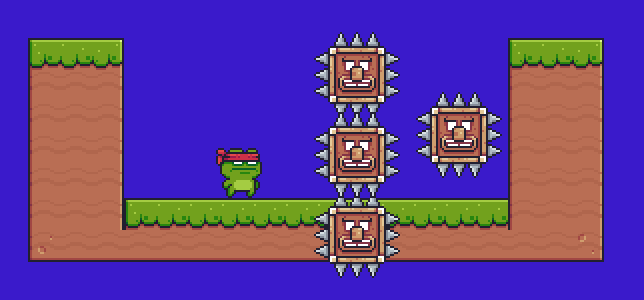

# Workshop - Godot Advanced

The purpose of this workshop is to show you how to enhance your game, with multiple features like a menu or a settings, and with coding good practices like configuration files.

## What is Godot

Godot is a free and open source game engine to develop and create 2D and 3D games, that can be played in linux, windows and even in web !
But you already know ~( \*O*)~

## Menu

To make it's better to have at first a Menu !

Do you remember scene ?

Todo list :

- Create a "Menu" scene
- Create Title Game Label
- Create Play, Qredits, Quit button
- For each button, redirect to a scene or make an appropriate action

***_TIPS_***

- *Do you know VBoxContainer ? Redirection ?*

## Settings

We have menu but no settings ?
We want a setting page where we can change at least music volume and the window size.
You can add any editable game value in settings.

- Create a "Settings" scene
- Add a sound slider
- Add the possibility to change the window size
- Add a "Settings" button in menu and an access in the game scene
- Create a return button (and adapte the redirection with the parent scene)

***_TIPS_***

- *Try to go in and out your settings page. Your settings are okay ?*
- *Do you know Slider? Bus volume?*

## User Interface (UI)

Hey, can I see my lives, points or game progress?
I think you need a nice UI!
- As useal create a scene for ui in game.
- Add showing progression
- Configure a key to show or unshow UI

## Configuration File

Let's go back to our wonderful game !

It's been a long... (or not ?)

You thought we had finished with it **BUT** let's talk about a way to make it more generic game !

Actually when you want to create a new enemy you have to instanciate a new child scene for each enemy or even entity you want to had. That's kind of messy !

>*Imagine coding a pokemon like while doing like... the **headache**...*

**HOWEVER** Godot gives us a wonderful way to be more generic, by its configuration files !

Your task, if you accept it, is to take any of the node that you have to instanciate manually and create a script that read a configuration file and initialize them for you !

> **HINT**: Reading the documentation *might* be a good idea :D

> **HINT**: Look at Packed Scene is :D

At the end you should be able to do something like this:

## Publish Game (Itch.io)

Congrats kid, you've done it !

It was a wonderful journey, full of people that you lost, that you met and people who loved you.

**You are inspiring !**

**So show the world what you are capable of !**

### Export your project

The first thing to show the world what you are capable of, is to give a way for people to download it !

Try to export your Godot Game in the format you want, Windows Executable, Linux Binary or even Web Game !

### Join the Game Dev World

[Itch.io](https://itch.io) is a platform where people publish their games, their assets (even the one we are using :3) and organise Game Jam or other game development good stuff !

All the work you've done ! **SHOW IT TO THE WORLD**

Join us.

> Create a [Itch.io](https://itch.io) project and load the game executable or web page you've created !

## Conclusion

*Do not cry because it is the end, but because it happened*

It is the end.

...Actually not really, we have provided you some bonus features to do to enhance your game !

Enjoy !

## Bonus

Choose the way you want "Make better", "Going futher" or/and "Create you own Game" !!

### Make better

- publish in web (Itch.io)
- create a TileSet
- Add animation and movement
- Upgrade Ennemies (projectiles, spawn, behavior)

### Going futher

- Scord Board
- Dialogue with png
- Choose Skin
- Particule and light

### Create your own Game !!

## Contributors

Thanks to these 2 people:

Rahul Chander: rahul.chander@epitech.eu

Tiphaine Bertone: tiphaine.bertone@epitech.eu
