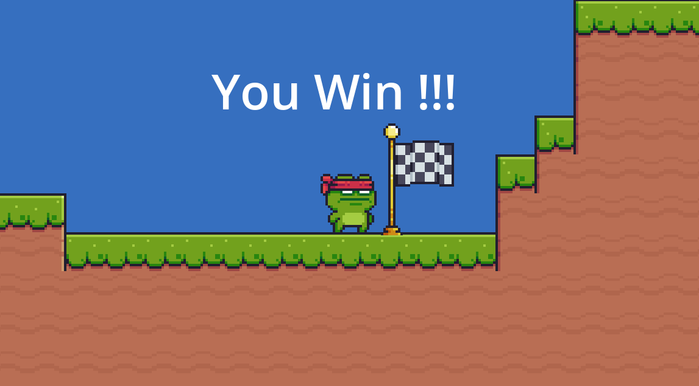

# Workshop - Godot Avancé

## What is Godot

Godot is a free and open source game engine to develop and create 2D and 3D games, that can be played in linux, windows and even in web !

## Install Godot

In order to install Godot follow this link: https://godotengine.org/download/linux/ (for Linux) and https://godotengine.org/download/windows/ (for Windows).

Install the version of godot corresponding to your compute

If you have issue at install feel free to contact us !

## Create a new project

Create a new Godot project in the path you want.

__NOTE__: You may need this: [Godot Documentation](https://docs.godotengine.org/en/stable/)

## Menu

To make it's better to have at first a Menu !

Do you remember scene ?

Todo list :

- Create a "Menu" scene
- Create Title Game Label
- Create Play, Qredits, Quit button
- For each button, redirect to a scene or make an appropriate action

***_TIPS_***

- *Do you know VBoxContainer ? Redirection ?*

## Settings

We have menu but no settings ?
We want a setting page where we can change at least music volume and the window size.
You can add any editable game value in settings.

- Create a "Settings" scene
- Add a sound slider
- Add the possibility to change the window size
- Add a "Settings" button in menu and an access in the game scene
- Create a return button (and adapte the redirection with the parent scene)

***_TIPS_***

- *Try to go in and out your settings page. Your settings are okay ?*
- *Do you know Slider? Bus volume?*

## Bonus

Hey, it is the end, did you like everything you've learned ? I hope so !

But don't worry, there is still a loooooot to do !

Video games are fun and so, enjoy yourself creating everything you ever wanted, these are examples of what you could do:

* Custom End of game / create a full level
* New enemies (Failing enemies, Static enemies, etc)
* Projectiles
* Using TileSets for background

All your dreams can become true !

*If you finish the workshop! Come to us, We have lots of ideas !*

## Contributors

Thanks to these 2 people:

Rahul Chander: rahul.chander@epitech.eu

Tiphaine Bertone: tiphaine.bertone@epitech.eu
