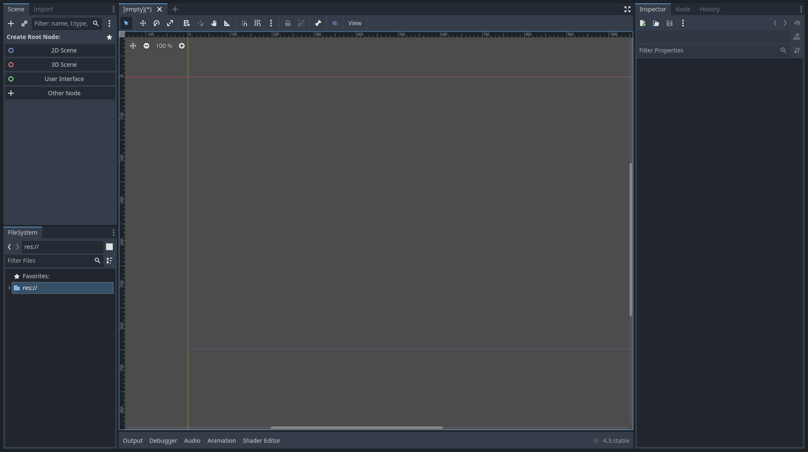
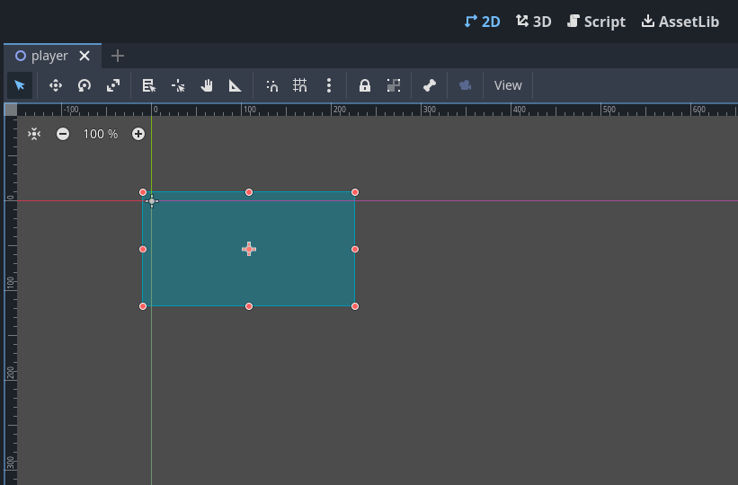
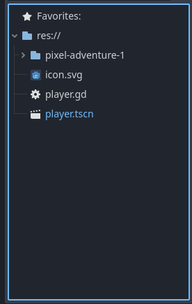
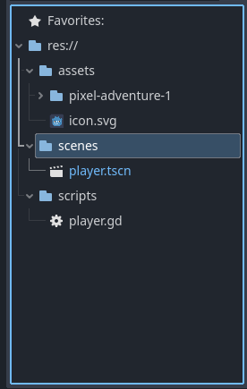
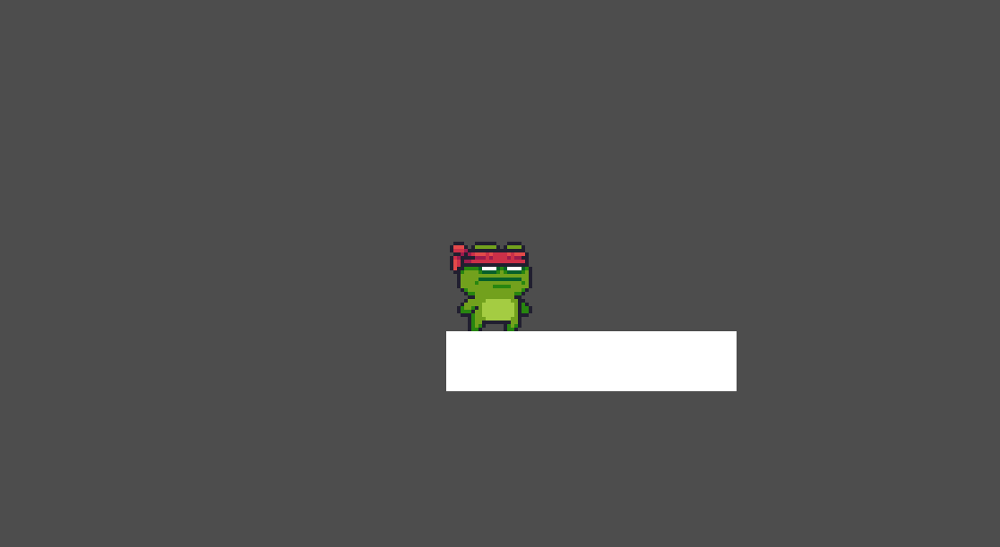
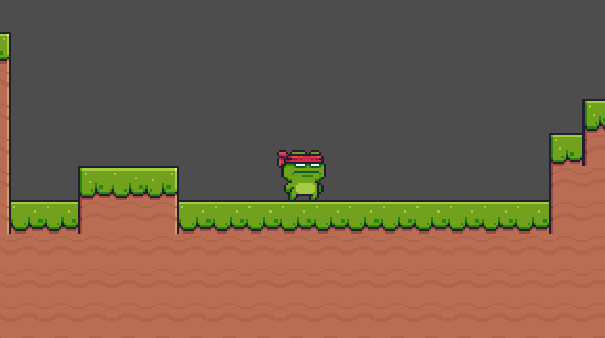
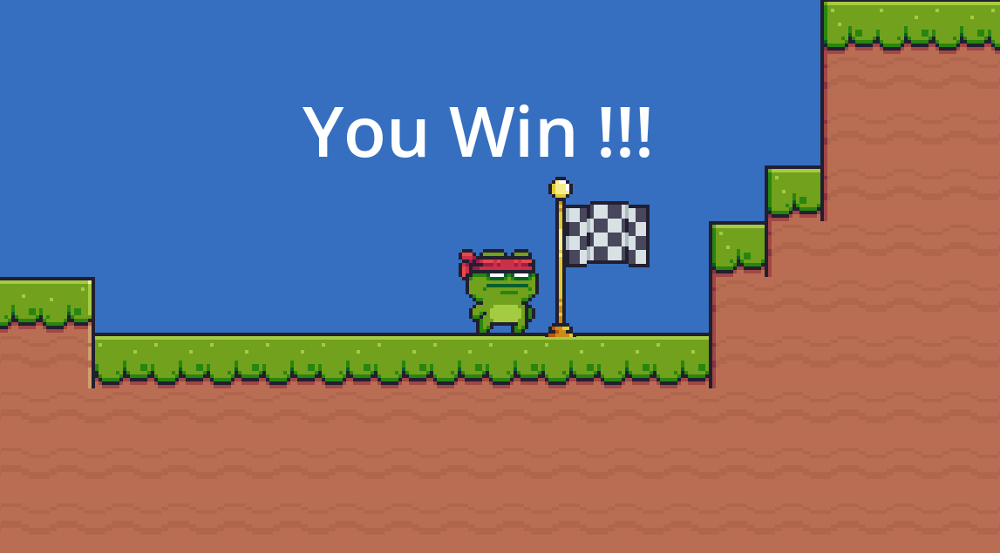

# Workshop - Initiation à Godot

## What is Godot

Godot is a free and open source game engine to develop and create 2D and 3D games, that can be played on linux, windows and even in web !

## Install Godot

In order to install Godot follow this link: https://godotengine.org/download/linux/ (for Linux) and https://godotengine.org/download/windows/ (for Windows).

Install the version of godot corresponding to your computer

If you have an issue while installing feel free to contact us !

## Create a new project

Create a new Godot project at the path you want.

__NOTE__: You may need this: [Godot Documentation](https://docs.godotengine.org/en/stable/)

## Create a Player !

We will here try to create a few nodes representing the player, the player's root node, the collision node or the animation sprite node.

Then we will assign to this new player scripts to make him move and have a beautiful life :3.

### Godot is pretty :blush:

**APPRECIATE HOW PRETTY IS GODOT !**



Oh...

You're not convinced  ?
Let's see what godot is capable of !

### Node and Scene

Godot Game Engine works with 2 main components **scenes** and **nodes**.

* A **node** is a "*block*" containing informations about the game logic, the rendering or the User Interface (UI).
**Nodes** are organised as a tree, you have a main node which has childs nodes and thoses childs nodes have childs too and so on.

* A **scene** is a regroupment of node that are organised as a tree, they represents specific logics in the game, like a `Player` or an `Enemy`.

Understanding this game engine architecture is the key to the development of amazing games in Godot. We **encourage** you to look at the documentation about that: [nodes and scenes](https://docs.godotengine.org/en/stable/getting_started/step_by_step/nodes_and_scenes.html).

### Create Player scene

We will create our first scene now, when you save a scene name it `player.tscn` !

Also, as we said before we need a few nodes for the player to handle 2D physics or collisions.

#### Player base node

First, create a new player node for the player, to do so we suggest you to take a look at `CharacterBody2D`, it has everything you want :3.

Name this node, `Player` (It will be easier to handle it).

The node `Player` is named *root node*, every node that you want for the player **must** be a child/sub-child of this node

Create a child node to the node `Player` and choose a collision node (we will let you figure out which one :D), and choose a Rectangle Shape for this node.

Now let's take a look at the 2D view of godot:



Here you can manipulate and move your collision shape as you wish !

#### Sprite Player

Our player is really ugly when we think about it.

Yeah, I know. "what player" you're asking ?

You're right, a collision shape cannot represent how **Magnificient** our player can be !

So let's try to change its look a little bit !

Add to the `Player` an `AnimatedSprite2D` node and select the spritesheet you want !

Yes, as we are really good people, we did not choose to steal other's work...

Yeah people like us still exists !

We still suggest you a really good spritesheet: [pixel-adventure-1](https://pixelfrog-assets.itch.io/pixel-adventure-1)

>! Don't forget the tip !

#### Handle enemy collisions

*Hey, but didn't we already added a collision node ?*

Yeah, you're right, but we only handled the physical effect of a collision without taking account of the object we collide with or the side effect we would have wanted !

>! If you did not understand my last sentence take a look at the difference between `CharacterBody2D` and `Area2D`.

### Player Script

Now let's do some coding, we have to attach a script to the `Player` node to be able to control him.

#### Sprite Movements

It will be probable that the Godot UI already gives you the `_physics_process` function which permits to implement the character physics.

However, let's try to go a little bit further in the exercice !

* Implement player's movements with arrow keys
* The player should not fall below 100 on Y coordinate (We will later add a floor).
* If the player has the SHIFT Key pressed it should go `k` times further (value `k` is yours to choose)

#### Sprite Animation

In a script there is a function that is called one time at the begining, when the scene is load, it is: `_ready` and there is also a function that is called each time you want the game updates and it is `_process`.

Inside this function, call a function named `add_animation` (that you must create), that will update the animation state based on the velocity, the position, everything you want.

Exemple:
```gd
func add_animation():
    if velocity.x == 0:
        ....
    ....
```

### Repository

Hey, I saw you !

Does your repository look like this ?:



If so we're going to change it, imagine you want to add 10 scenes, you would put it all these files in specific directories.

* All scenes should be in a `scenes` directory
* All scripts should be in a `scripts` directory
* All assets should be in a `assets` directory

Like:



Isn't it better now ?

## Create a Level Map

Okay now we want a real game ! (and test your player movement)

### Scene MainGame

Let's start whith the creation of the "MainGame" scene!
I'ts where you collect all the scenes (player, plateform, ennemies)

Todo List :
- Creation of the "MainGame" scene
- Add "Player" scene in the "MainGame" scene
- Add a Camera that follow the player
- Make the "MainGame" as the main scene
- Try to play

***_TIPS_***

- *You can see what is a Child Scene in Godot.*
- *Godot is simple! A child undergoes the same physics changes as his parents*

I think you see your player fall...
Maybe we need a floor.

### Create a Floor

We need a floor where the player can walk.
Try to create a simple platform.
You can use 2 methods (or a mix):
- Create own made platform
- Create a TileMap




***_TIPS_***

- *What's is StaticBody2D ? Did you need collision again ?*
- *What's is TileMap ? Don't you forget collision ?*

## Enemies

Our little player is lonely, I wish we could bring him some friends....

**HEY**

### Create new enemies

As we did for the player, we let you create a new scene, a new root node (preferably a `CharacterBody2D`) and 2 subnodes, for collision and for sprite.

For this workshop, the enemies will be moved by a script (mostly) you are going to make, but if you want a special enemy movements (like an enemy failing from sky), you can try using a `RigidBody2D`. If you don't know what it is feel free to take a look at the documentation: [godot-physics-introduction](https://docs.godotengine.org/en/4.1/tutorials/physics/physics_introduction.html).

### Implementing the collisions

You remember the `Area2D` created for the player we created before ?

It is going to be **useful**.

Let's talk about signals.

In Godot signals are way to informs/execute specific nodes/scripts when an event occured. For example, the player got hit by a bullet, **BOOOM** Signal.

And here when a collision is occuring we want a script to be triggered, that will handle the consequences of it.

What you need to do is:

* Handle the event of `Area2D`
* Trigger a new `hit` event
* Handle `hit` in the main game scene (just put a single printing to indicate that a collision appeared)

__NOTE__: Careful you can implement a signal handler in the node that emits the signal **and** also in parents nodes.

### Ending the game

Now implement the fact that if a collision appears, the scene reload completely itself.

Don't worry it is not that hard !

Isn't it ?

## Bonus



Hey, it is the end, did you like everything you've learned ? I hope so !

But don't worry, there is still a loooooot to do !

Video games are fun and so, enjoy yourself creating everything you ever wanted, these are examples of what you could do:

* Custom End of game / create a full level
* New enemies (Failing enemies, Static enemies, etc)
* Projectiles
* Using TileSets for background

All your dreams can become true !

*If you finish the workshop! Come to us, We have lots of ideas !*

## Contributors

Thanks to these 2 people:

Rahul Chander: rahul.chander@epitech.eu

Tiphaine Bertone: tiphaine.bertone@epitech.eu
