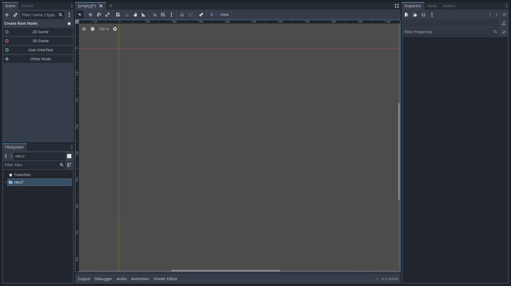

# Workshop - Initiation à Godot

## What is Godot

Godot is a free and open source game engine to develop and create 2D and 3D games, that can be played in linux, windows and even in web !

## Install Godot

In order to install Godot follow this link: https://godotengine.org/download/linux/ (for Linux) and https://godotengine.org/download/windows/ (for Windows).

Install the version of godot corresponding to your compute

If you have issue at install feel free to contact us !

## Create a new project

Create a new Godot project in the path you want.

## Create a Player !

We will here try to create 3 nodes, representing the player, the player's root node, the collision node and the sprite node.

Then we will assign to this new player we had scripts to make him move and have a beautiful life :3.

### Godot is pretty :blush:

**APPRECIATE HOW PRETTY IS GODOT !**

Oh...

You're not conviced ?
Let's see what godot is capable of !

### First Godot Scene

Explain godot scene/nodes with the documentation

### Create Player nodes

Create a new player node for the player, we suggest you to take a look at `CharacterBodyNode2D`.

It has everything you need to perform 2D interaction, gravity or even collisions !

=> Creation of the 3 nodes
=> Have sprites

### Player Script

==> How to create a script

Enjoy the 2D and 3D view !

#### Sprite Movements

#### Sprite Animation

## Floor

## Enemies

## Bonus

=> Custom End of game
=> New enemies
=> The floor is lava

